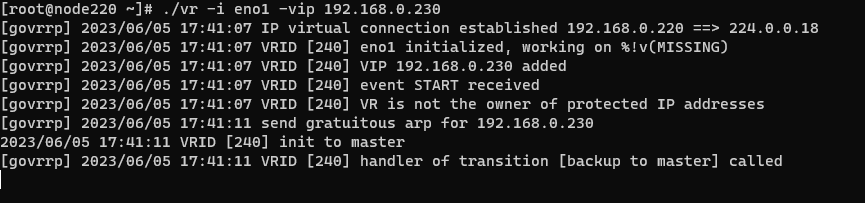

# Go VRRP 示例程序使用说明


编译Demo

```shell
GOOS=linux go build -o vr
```

Demo程序参数

```bash
Usage of ./vr:                          
  -i string                             
        网卡名称 (default "eno1")       
  -id int                               
        虚拟路由ID (1~255) (default 240)
  -itl int                              
        发送间隔毫秒数 (default 800)
  -p int
        虚拟路由器优先级(1~255)，255表示主机拥有者 (default 100)
  -t int
        虚拟路由器类型(4:IPv4 6:IPv6) (default 4)
  -vip string
        虚拟IP地址
```

- 源代码： [main.go](main.go)

运行效果如下：




在MASTER节点上执行：

```bash
#execute on MASTER NODE
./vr -i eno1 -p 255 -vip 192.168.0.230
```

在BACKUP节点上执行：

```bash
#execute on BACKUP NODE
./vr -i eno1 -p 100 -vip 192.168.0.230
```

